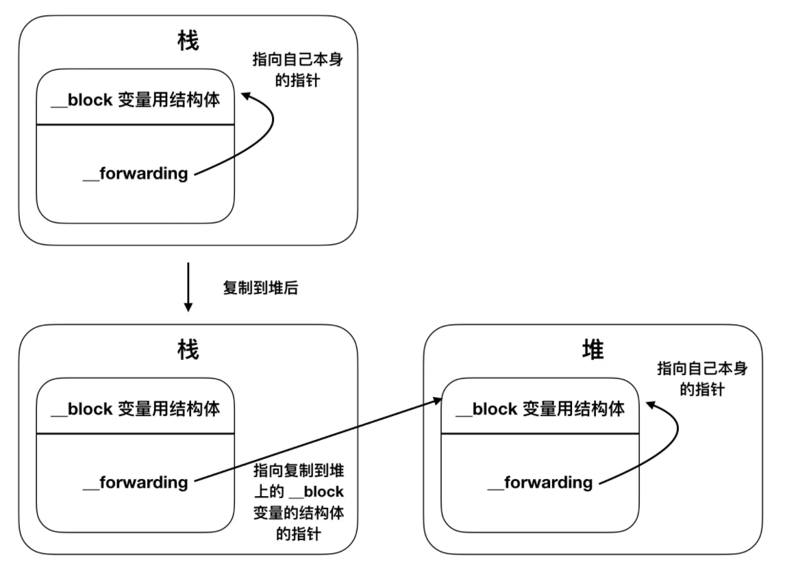

# iOS Teach Team iOS深入理解Block

### 引言
> 在Objective-C日常开发中，Block是使用频率相对是比较多的，你不会每天都做启动优化，你也不会每天都做性能优化，但你有可能每天都在用Block，本文就着重介绍一下Block在日常开发中，那些值得我们关注的点，大家一起学习。

---
* ### 代码规范
```
// 定义一个Block
typedef returnType (^BlockName)(parameterA, parameterB, ...);

eg: typedef void (^RequestResult)(BOOL result);

// 实例
^{
    NSLog(@"This is a block");
 }
```
---
* ### 本质

Block本质上是一个Objective-C的对象，可以添加到NSArray及NSDictionary等集合中，它是基于C语言及运行时特性，有点类似标准的C函数，但除了可执行代码以外，另外包含了变量同堆或栈的自动绑定。

---
* ### 常用介绍

* Block的类型：

1. __NSGlobalBlock__
```
void (^exampleBlock)(void) = ^{
    // block
};
NSLog(@"exampleBlock is: %@",[exampleBlock class]); 
```
打印日志：`exampleBlock is: __NSGlobalBlock__`

如果一个Block没有访问外部局部变量，或者访问的是全局变量，或者静态局部变量，此时的Block就是一个全局Block，并且数据存储在全局区。

2. __NSStackBlock__
```
int temp = 100;
void (^exampleBlock)(void) = ^{
    // block
    NSLog(@"exampleBlock is: %d", temp);
};
NSLog(@"exampleBlock is: %@",[exampleBlock class]);
```
打印日志：`exampleBlock is: __NSMallocBlock__`？？？
不是说好的`__NSStackBlock__`的吗？为什么打印的是`__NSMallocBlock__`呢，这里是因为我们使用了ARC，Xcode默认帮我们做了很多事情，我们可以去Build Settings里面，找到Objective-C Automatic Reference Counting，并将其设置为No，然后再Run一次代码。
你会看到打印日志是：`exampleBlock is: __NSStackBlock__`

如果Block访问了外部局部变量，此时的Block就是一个栈Block，并且存储在栈区，由于栈区的释放是由系统控制，因此栈中的代码在作用域结束之后内存就会销毁，如果此时再调用Block就会发生问题，( **注：** 此代码运行在MRC下)如：
```
void (^simpleBlock)(void);
void callFunc() {
    int age = 10;
    simpleBlock = ^{
        NSLog(@"simpleBlock------%d", age);
    };
}

int main(int argc, char * argv[]) {
    NSString * appDelegateClassName;
    @autoreleasepool {
        callFunc();
        simpleBlock();
        // Setup code that might create autoreleased objects goes here.
        appDelegateClassName = NSStringFromClass([AppDelegate class]);
    }
    return 0;
}
```

打印日志：`simpleBlock---------41044160`

3. __NSMallocBlock__

当一个`__NSStackBlock__`类型Block做copy操作后就会将这个Block从栈上复制到堆上，而堆上的这个Block类型就是`__NSMallocBlock__`类型，在ARC环境下，编译器会根据情况，自动将Block从栈上copy到堆上，具体会进行copy的情况有如下4种：
* Block作为函数的返回值时；
* Block赋值给__strong指针，或者Block类型的成员变量时；
* Block作为Cocoa API中方法名含有usingBlock的方法参数时；
* Block作为GCD API的方法参数时；

---
### **__block的作用**

```
__block int age = 10;
void (^exampleBlock)(void) = ^{
    // block
    NSLog(@"1.age is: %d", age);
    age = 16;
    NSLog(@"2.age is: %d", age);
};
exampleBlock();
NSLog(@"3.age is: %d", age);
 ```
__block主要用来解决Block内部无法修改auto变量值的问题，为什么加上__block修饰之后，auto变量值就能修改了呢，这是因为，加上__block修饰之后，编译器会将__block变量包装成一个结构体__Block_byref_age_0，结构体内部*__forwarding是指向自身的指针，并且结构体内部还存储着外部auto变量。
```
struct __Block_byref_val_0 {
    void *__isa; // isa指针
    __Block_byref_val_0 *__forwarding; 
    int __flags;
    int __size; // Block结构体大小
    int age; // 捕获到的变量
}
```


从上图可以看到，如果这block是在栈上，那么这个__forwarding指针就是指向它自己，当这个block从栈上复制到堆上后，栈上的__forwarding指针指向的是复制到堆上的__block结构体，堆上的__block结构体中的__forwarding指向的还是它自己，即age->__forwarding获取到堆上的__block结构体，age->__forwarding->age会把堆上的age赋值为16，因此不管是栈上还是堆上的__block结构体，最终使用到的都是堆上的__block结构体里面的数据。

---
### 拓展知识
* 思考题
Block内部修改NSMutableString、NSMutableArray、NSMutableDictionary对象，需不需要添加__block？

---
### 总结


---
**最后：？！**