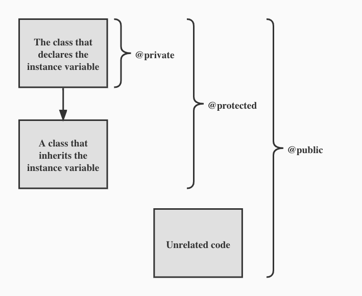
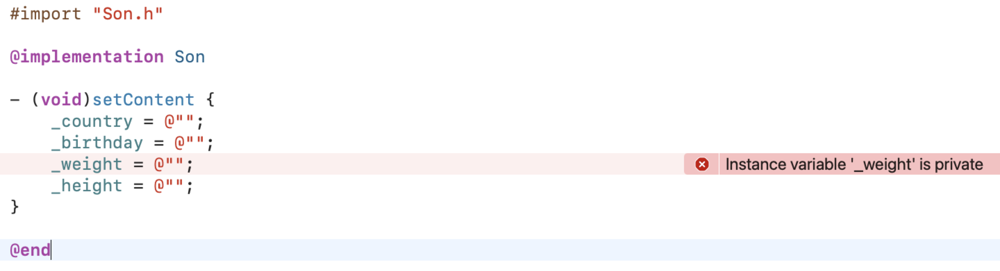
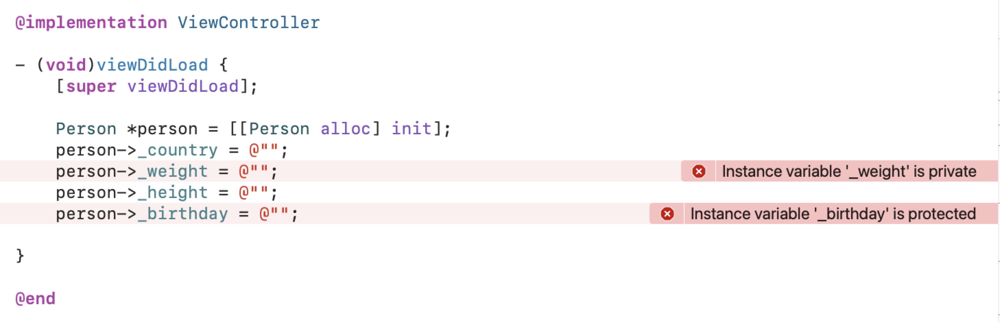

# iOS Teach Team iOS分类与扩展详解

### 引言

> 类别允许你即便没有源代码，仍然可以向现有的类中添加方法。类别的功能很强大，它允许你无需子类化而扩展现有类。使用类别，还可以将类的实现分发到多个文件中。类扩展与此类似，但允许在主类@interface 块内以外的位置为类声明额外的必需 API。
---
* ### 代码规范

**Category:**
```
#import "ClassName.h"
 
@interface ClassName (CategoryName)
// method declarations
@end
```

**Extension:**
```
@interface MyClass : NSObject
@property (retain, readonly) float value;
@end
 
// Private extension, typically hidden in the main implementation file.
@interface MyClass ()
@property (retain, readwrite) float value;
@end
```

---
* ### 本质

您可以通过在接口文件中，以类别名称声明它们，并在实现文件中以相同名称定义它们来将方法添加到类。类别名称表明这些方法是对在别处声明的类的添加，而不是一个新类。但是，不能通过类别添加实例变量到类中。

类别添加的方法成为类类型的一部分。例如，在一个类别中添加到NSArray类中的方法，是编译器期望NSArray实例在其配置表中包含的方法。然而，子类中添加到NSArray类中的方法并不包含在NSArray类型中。(这只对静态类型的对象有影响，因为静态类型是编译器知道对象类的唯一方式。)

---
* ### 常用介绍

**分类：**

分类在经历过编译后，分类里面的内容：对象方法、类方法、协议、属性都转化为类型为category_t的结构体变量：
```
struct category_t {
    const char *name;
    classref_t cls;
    WrappedPtr<method_list_t, PtrauthStrip> instanceMethods;
    WrappedPtr<method_list_t, PtrauthStrip> classMethods;
    struct protocol_list_t *protocols;
    struct property_list_t *instanceProperties;
    // Fields below this point are not always present on disk.
    struct property_list_t *_classProperties;

    method_list_t *methodsForMeta(bool isMeta) {
        if (isMeta) return classMethods;
        else return instanceMethods;
    }

    property_list_t *propertiesForMeta(bool isMeta, struct header_info *hi);
    
    protocol_list_t *protocolsForMeta(bool isMeta) {
        if (isMeta) return nullptr;
        else return protocols;
    }
};
```
具体Category都能做什么，常用的大致有如下几个场景：
1. 在不修改原有类的基础上给原有类添加方法，因为分类的结构体指针中没有属性列表，只有方法列表。所以原则来说只能给分类添加方法，不能添加属性，如果需要给分类添加类似属性功能，可以通过关联对象实现；
2. 分类中的方法优先于原有类同名的方法, 即会优先调用分类中的方法, 忽略原有类的方法。即分类与原有类同名方法调用的优先级为： 分类 > 本类 > 父类。开发中尽量不要覆盖本类的方法，如果覆盖会导致本类方法失效；
3. 如果给Category添加@property属性，只会生成setter和getter方法的声明，并不会有具体的代码实现，详细解释可参考历史文章：[iOS探究属性@property](https://github.com/minhechen/iOSTechTeam/blob/main/Blogs/iOSTechTeam_01.md)
4. 分类中可以访问原有类中 `.h` 中声明的成员变量；


---
### **类的扩展Extension：**

```
@interface Person ()

@end
```
类的Extension看起来很像一个匿名的Category。通常用来声明私有方法，私有属性和私有成员变量。

> extension 在编译期决议， category在运行期决议。

类扩展不能像类别 `Category` 那样拥有独立的实现部分（@implementation部分），也就是说，类的扩展所声明的方法必须依托原类的实现代码部分来实现。

因此，我们不能给系统类添加类扩展。即扩展的方法只能在原类中实现。例如我们扩展NSString，那么只能在 `NSString的.m` 中实现，但我们拿不到 `NSString的.m` 的源码，因此，我们不能给 `NSString` 添加扩展，只能给 `NSString` 添加分类；

定义在 `.m` 文件中的类扩展方法为私有的，如果需要声明私有方法，这种方式特别合适，定义在 .h 文件（头文件）中的类扩展方法为公有的。


扩展与分类的区别
1.分类有名字，扩展没有名字，像是一个匿名的分类
2.分类是运行时决议，而扩展是编译时决议；所以分类中的方法没有实现不会警告，而扩展声明的方法不实现会出现警告。
3.分类原则上可以增加属性，实例方法，类方法，而且外部类是可以访问的。扩展能添加属性，方法，实例变量，默认是不对外公开的。
4.分类有自己的实现部分，扩展没有自己的实现部分，只能依赖类本身来实现。
5.可以为系统类添加分类，而不能为系统类添加扩展。

---
### **+ load, + initialize，类，分类，父类调用规则，编译顺序对函数调用的影响**
---
### 拓展知识
1. iOS中变量修饰词@public、@protected、@package、@private的作用：
> @package // 常用于框架类的实例变量，使用@private太限制，使用@protected或者@public又太开放，这时可以使用@pakage
>
> @private // 作用范围只能在自身类，即使子类也无法使用，但分类及扩展类中可以使用
>
> @protected // 系统默认为@protected，作用范围在自身类及子类
>
> @public // 公开类型，作用域大，只要能拿到所属实例对象就可以使用
>

实例变量范围图（`@package` 的范围图中未展示）



```
@interface Person : NSObject {
@package
    NSString *_country; // 框架内拿到Person及其子类的实例变量都可以使用

@protected
    NSString *_birthday; // 只能在自身类及子类中使用，包括分类及扩展

@private
    NSString *_weight; // 只能在自身类中使用，包括分类及扩展

@public
    NSString *_height; // 全局任意拿到Person及其子类实例变量的地方都可以使用
}
```
具体实例如下： `Son` 继承自 `Person`：
```
@interface Son : Person

@end
```

@protected
从上图示例代码可以看到，在子类中是可以访问父类的 `@protected _birthday` 成员变量，但不能访问父类的 `@private _weight` 成员变量。


从上图示例代码可以看到，在其他类中是可以访问父类的 `@protected _birthday` 成员变量，但不能访问父类的 `@private _weight` 成员变量。


---
### 总结


---
**最后：期望接下来能再写一篇！**

### **参考资料：**

* [Categories and Extensions](https://developer.apple.com/library/archive/documentation/Cocoa/Conceptual/ObjectiveC/Chapters/ocCategories.html)

* [Defining a Class](https://developer.apple.com/library/archive/documentation/Cocoa/Conceptual/ObjectiveC/Chapters/ocDefiningClasses.html#//apple_ref/doc/uid/TP30001163-CH12-SW1)