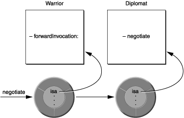

# iOS Teach Team iOS 探究 | 第八篇 Runtime 详细探究

探究系列**已发布文章**列表，有兴趣的同学可以翻阅一下：

[第一篇 | iOS 属性 @property 详细探究](https://mp.weixin.qq.com/s?__biz=MzAxNjIzNjI4Mg==&mid=2450076636&idx=1&sn=bd581243bfce19b83c508336f780b3e8&chksm=8c0a7849bb7df15fb2d280e8f0e971f1d31a5a435179fa62d28ab6ced8988c875f4366c991db&scene=21&token=898954029&lang=zh_CN#wechat_redirect)

[第二篇 | iOS 深入理解 Block 使用及原理](https://mp.weixin.qq.com/s?__biz=MzAxNjIzNjI4Mg==&mid=2450076720&idx=1&sn=e80b68663ea810d223a9e3a9240f0a9f&chksm=8c0a7fa5bb7df6b3d63f19040fc99b66600a77a301d1ee89d788048a8720cba6691257204cee&token=898954029&lang=zh_CN#rd)

[第三篇 | iOS 类别 Category 和扩展 Extension 及关联对象详解](https://mp.weixin.qq.com/s?__biz=MzAxNjIzNjI4Mg==&mid=2450076808&idx=1&sn=986dfd85f4785f79f4517cce4cf9b690&chksm=8c0a7f1dbb7df60b1dc2073f98c379f1acb50fd0cd8508141b6072633791c1d57d0e66016cb0&token=898954029&lang=zh_CN#rd)

[第四篇 | iOS 常用锁 NSLock ，@synchronized 等的底层实现详解](https://mp.weixin.qq.com/s?__biz=MzAxNjIzNjI4Mg==&mid=2450076878&idx=1&sn=6c452c7d885826ce12db3f754111b7cd&chksm=8c0a7f5bbb7df64d59e6461ad8cb86e6922bda3af35e488b0d7c924d16e91abe174d72de3f38&token=898954029&lang=zh_CN#rd)

[第五篇 | iOS 全面理解 Nullability](https://mp.weixin.qq.com/s?__biz=MzAxNjIzNjI4Mg==&mid=2450076953&idx=1&sn=b0f51d90c9a6eff16391fa92dd2b12dd&chksm=8c0a7e8cbb7df79a2bfe089f2d6227aa5cde67f13dfa09117184892185245287ab388a5bce25&token=898954029&lang=zh_CN#rd)

[第六篇 | iOS Equality 详细探究](https://mp.weixin.qq.com/s?__biz=MzAxNjIzNjI4Mg==&mid=2450076977&idx=1&sn=9f50109bd27400c19e43826ed2c392d4&chksm=8c0a7ea4bb7df7b21eb1e8b8a9f56d250d83a201b68cd1d515beebbba16157601566cf45b6a3&token=1873620973&lang=zh_CN#rd)

[第七篇| iOS 异常 (NSException) 和错误 （NSError) 处理详解](https://mp.weixin.qq.com/s?__biz=MzAxNjIzNjI4Mg==&mid=2450076989&idx=1&sn=ae2b534af7c12792374fb94ee86f3bbd&chksm=8c0a7ea8bb7df7be2dde4c15145b3f7bc9716781c84fbd5e37b003cd16c645b6481185c78b2b&token=1120662286&lang=zh_CN#rd)


------- 正文开始 -------

### **引言**
> Objective-C 语言将尽可能多的决策从编译和链接时推迟到运行时(Runtime)。也就是说只要有可能，它就会动态地做事。这意味着 Objective-C 不仅需要编译器进行编译，还需要 Runtime 来执行编译后的代码。可以说 Runtime 是使 Objective-C 语言工作的基础，充当了 Objective-C 语言的一种操作系统，。

---
### **运行时版本和平台**

Legacy 和 Modern

Objective-C runtime 有两个版本，即 “modern” 和 “legacy”。现代版本是在 Objective-C 2.0 中引入的，包括许多新特性。现代版 runtime 的编程接口在 Objective-C 文档中有详细的描述，具体可查看 [Objective-C Runtime](https://developer.apple.com/documentation/objectivec/objective-c_runtime?language=objc)。

最值得注意的新特性是现代运行时中的实例变量是“非脆弱的”：

* 在旧版 runtime 中，如果更改类中实例变量的布局，则必须重新编译它及其子类。
* 在现代 runtime 中，如果更改类中实例变量的布局，则不必重新编译它及其子类。

此外，现代运行时支持声明属性的实例变量合成。


### **运行时交互**

* **Objective-C 程序在三个不同层次上与运行时系统交互：**

**1. 通过 Objective-C 源代码：**
> >  在大多数情况下，运行时系统在幕后自动运行。我们只需编写和编译 Objective-C 源代码即可使用它。
> >
> > 当我们编译包含 Objective-C 类和方法的代码时，编译器会创建数据结构和函数调用来实现语言的动态特性。数据结构捕获类和类别定义以及协议声明中的信息。它们包括在 Objective-C 中定义的类和协议中讨论的类和协议对象，以及方法选择器、实例变量模板和其他从源代码中提取的信息。主要的运行时函数是发送消息的函数，下面消息传递中会详细介绍，它由源代码消息表达式调用。

**2. 通过 Foundation 框架的 NSObject 类中定义的方法：**

Cocoa 中的大多数类都是 `NSObject` 类的子类，因此大多数对象都继承了它定义的方法。（注意：`NSProxy` 类是个例外，下面消息转发部分会详述）因此，它的方法建立了对每个实例和每个类对象固有的行为支持。在有些情况下，`NSObject` 类只是定义了一个模板，用于描述应该如何操作，它本身并不提供相应代码实现。

例如，`NSObject` 类定义了一个描述实例方法，该方法返回一个描述类内容的字符串。这主要用于调试 GDB print-object 命令打印从此方法返回的字符串。`NSObject` 的这个方法的实现并不知道类包含什么，所以它返回一个带有对象名称和地址的字符串。`NSObject` 的子类可以实现这个方法来返回更多的细节。例如，`Foundation` 类 `NSArray` 返回它包含的对象的描述列表。

一些 NSObject 方法只是查询运行时系统以获取想要的信息，这些方法允许对象执行自我检查。此类方法的示例是类方法，它要求对象识别其类：

* isKindOfClass: 和 isMemberOfClass: 检查对象在继承层次结构中的位置；
* respondsToSelector: 表示一个对象是否可以接受特定的消息； 
* conformsToProtocol: 表示对象是否声称实现了特定协议中定义的方法；
* methodForSelector: 它提供了方法实现的地址；

以上的这些方法使对象能够进行自我检查。


**3. 通过直接调用运行时函数：**

运行时系统是一个动态共享库，其公共接口由位于目录 `/usr/include/objc` 中的头文件中的一组函数和数据结构组成。其中许多函数允许我们使用标准的 C 语言来复写编译器在编写 Objective-C 代码时所做的事情。其他则构成了通过 `NSObject` 类的方法实现功能输出的基础。这些功能使开发运行时系统的其他接口和生成增强开发环境的工具成为可能。

在 Objective-C 编程时它们不是必需的。但是，一些运行时函数有时很有用。所有这些函数都可以在[Objective-C Runtime](https://developer.apple.com/documentation/objectivec/objective-c_runtime?language=objc) 中查到。


### **消息传递**

这里重点介绍下消息表达式如何转换为 `objc_msgSend` 函数调用，以及如何通过名称引用方法。然后解释如何利用 `objc_msgSend`，以及如何规避动态绑定（正常来说不会这么做）。

**1. objc_msgSend 函数**

在 Objective-C 中，消息直到运行时才绑定到方法实现。编译器转换消息表达式，

```
[receiver message]
```

调用消息传递函数 `objc_msgSend`，该函数将接收者和方法名称（即方法选择器）作为它的两个主要参数：

```
objc_msgSend(receiver, selector)
```

消息中传递的全部参数也会传递给 objc_msgSend：

```
objc_msgSend(receiver, selector, arg1, arg2, ...)
```

消息传递函数完成动态绑定流程：

* 首先找到选择器对应的函数（方法实现）。由于相同的方法可以由不同的类以不同的方式实现，因此它准确的调用过程取决于接收器的类。
* 然后调用该函数，将接收对象（指向其数据的指针）以及该方法的所有参数传递给它。
* 最后，将调用函数的返回值作为自己的返回值返回。

**注意：** 编译器会自动生成对消息传递函数的调用。正常来说我们不应该在代码中直接调用它。

消息传递的关键在于编译器为每个类和对象构建的结构。每个类结构都包含以下两个基本元素：

* 指向超类的指针。
* 类调度表。该表有一些条目，它们将方法选择器与它们标识的方法的类的特定地址相关联。如：`setOrigin:` 方法的选择器与 `setOrigin:`（函数的实现）的地址相关联，`display` 方法的选择器与 `display` 的实现地址相关联，等等。

当一个新对象被创建时，会给其分配内存，并初始化实例变量。对象变量中的第一个变量是指向其类结构的指针。我们可以通过这个名为 `isa` 的指针访问其类，并通过该类访问它所继承的所有类。

**注意：** 虽然严格来说不是语言的一部分，但对象需要 `isa` 指针才能与 Objective-C 运行时系统一起工作。在结构体定义的字段中，对象需要与 `struct objc_object`（在 `objc/objc.h` 中定义）“等效”。但是，我们很少需要创建自己的根对象，并且从 `NSObject` 或 `NSProxy` 继承的对象都会自动具有 `isa` 变量。

类和对象的结构如下：


当消息被发送到一个对象时，消息传递函数跟随对象的 `isa` 指针指向类结构，它在调度表中查找方法选择器。如果在那里找不到选择器，`objc_msgSend` 会根据指向超类的指针找到超类，并尝试在其调度表中找到选择器。就这样 `objc_msgSend` 根据类的继承结构依次查找，直到找到 `NSObject` 类。一旦找到选择器，该函数就会调用在表中查找到的方法，并将接收对象的数据结构传递给它。

这是在运行时选择方法实现的方式，或者用面向对象编程的术语来说，方法是动态绑定到消息的。

为了加快消息传递过程，运行时系统会在使用方法时缓存方法的选择器和地址。每个类都有一个单独的缓存，它可以包含继承方法以及类中定义的方法的选择器。在查找调度表之前，消息传递例程首先检查接收对象类的缓存（理论上来说，使用过的方法可能会再次使用）。如果方法选择器在缓存中，消息传递只比函数调用慢一点。一旦一个程序运行了足够长的时间来“预热”它的缓存，它发送的所有消息基本上都会找到对应缓存方法。另外当程序运行时，缓存会动态增长以容纳新消息。


**2. 使用函数隐藏参数**

当 `objc_msgSend` 找到实现方法的函数时，它调用该函现并将消息中的所有参数传递给它。它还会向函数传递两个隐藏参数，即：

* 接收对象
* 方法的选择器

这两个参数在每个方法实现里面都有，它们是调用消息表达式完整信息的一部分。之所以说它们是“隐藏的”，是因为它们没有在定义该方法的源代码中声明，它们由编译器在编译代码时插入到相应的实现中。

尽管它们在函数中没有显式声明，源代码仍然可以直接引用它们（就像它可以引用接收对象的实例变量一样）。方法将接收对象称为 `self`，将自己的选择器称为 `_cmd`。 在下面的示例中，_cmd 指的是 `strange` 方法的选择器，而 `self` 指的是接收到 `strange` 消息的对象。

```
- strange
{
    id  target = getTheReceiver();
    SEL method = getTheMethod();
 
    if ( target == self || method == _cmd )
        return nil;
    return [target performSelector:method];
}
```
相对来说 `self` 是这两个参数中更有用的一个，也是我们使用频率比较高的一个，通常我们也是以这种方式在方法定义中使用接收对象的实例变量。

**3. 获取方法地址**

绕过动态绑定的唯一方法是获取方法的地址，并直接调用它，就好像它是一个函数一样。这可能仅适用于某些特定方法需要连续执行多次，并且我们希望避免因每次执行方法的消息传递而带来的开销时，正常来说这种场景极其少见。

使用 `NSObject` 类中定义的方法 `methodForSelector:` 我们可以获取一个指向方法实现的函数指针，然后使用该指针调用该函数。 `methodForSelector:` 返回的指针必须小心的转换为正确的函数类型。返回类型和参数类型都应该包含在转换中。

下面的示例显示了如何调用实现 `setFilled:` 方法的过程：
```
void (*setter)(id, SEL, BOOL);
int i;
 
setter = (void (*)(id, SEL, BOOL))[target
    methodForSelector:@selector(setFilled:)];
for ( i = 0 ; i < 1000 ; i++ )
    setter(targetList[i], @selector(setFilled:), YES);
```

传递给函数的前两个参数是接收对象 `self` 和方法选择器 `_cmd`。 这些参数隐藏在方法语法中，但在方法作为函数调用时必须明确显示。

使用 `methodForSelector:` 来规避动态绑定可以节省消息传递所需的大部分时间。但是，如上面所说，只有当特定消息重复多次发送时，才会有明显效果，如上面所示的 for 循环。

**注意：** `methodForSelector:` 是 `Cocoa` 运行时系统提供的，它不是 `Objective-C` 语言本身的特性。

### **动态方法解析**

**1. 动态方法解析**

在有些情况下，我们可能希望动态的提供方法的实现。 例如，Objective-C 声明的属性包含 `@dynamic` 指令：
```
@dynamic propertyName;

```
它告诉编译器与属性关联的方法将动态实现即由我们自己来实现，这时如果我们代码中没有实现的话，当函数调用对应的 getter/setter 方法时，会因找不到对应的方法而 Crash ，具体介绍，可以看一下之前的文章：[iOS 属性 @property 详细探究](https://mp.weixin.qq.com/s?__biz=MzAxNjIzNjI4Mg==&mid=2450076636&idx=1&sn=bd581243bfce19b83c508336f780b3e8&chksm=8c0a7849bb7df15fb2d280e8f0e971f1d31a5a435179fa62d28ab6ced8988c875f4366c991db&scene=21&token=898954029&lang=zh_CN#wechat_redirect)。

我们可以实现方法 `resolveInstanceMethod:` 和 `resolveClassMethod:` 来分别为实例和类方法指定的选择器（Selector）动态提供实现。

Objective-C 方法只是一个 `C` 函数，它至少有两个参数即 `self` 和 `_cmd`。 我们可以通过使用函数 `class_addMethod` 将函数作为方法添加到类中。因此，给定以下函数：
```
void dynamicMethodIMP(id self, SEL _cmd) {
    // implementation ....
}
```

我们可以在 `resolveInstanceMethod:` 中，将其作为方法动态添加到类中（称为 `resolveThisMethodDynamically`），如下所示：
```
@implementation MyClass
+ (BOOL)resolveInstanceMethod:(SEL)aSEL
{
    if (aSEL == @selector(resolveThisMethodDynamically)) {
          class_addMethod([self class], aSEL, (IMP) dynamicMethodIMP, "v@:");
          return YES;
    }
    return [super resolveInstanceMethod:aSEL];
}
@end
```

转发方法（如消息转发中所述）和动态方法解析在很大程度上是正交的。类有机会在转发机制生效之前动态地解析方法。如果调用 `respondsToSelector:` 或 `instancesRespondToSelector:`，动态方法解析器有机会为选择器提供 `IMP` ，如果有就执行对应的函数调用并返回 YES，如果没有则继续往下执行。如果实现了 `resolveInstanceMethod:` 但希望通过转发机制实际转发特定的选择器，则为这些选择器返回 `NO`。


**2. 动态加载**

Objective-C 程序可以在运行时加载和链接新的类和类别。这些加载和链接的新代码被合并到程序中，它们与启动 App 时加载的类和类别同等对待。

动态加载可以用来做很多的事情。例如，系统偏好应用程序中的各种模块都是动态加载的。

在 Cocoa 环境中，通常使用动态加载来定制应用程序。我们的程序可以在运行时加载其他人编写的程序模块，就像 `Interface Builder` 加载自定义调色板和 `OS X System Preferences` 应用程序加载自定义首选项模块一样。可加载模块扩展了应用程序的功能，我们提供框架，其他人提供代码进行功能扩展。

虽然在 Mach-O 文件中有一个运行时函数执行 Objective-C 模块的动态加载（`objc_loadModules`，在 `objc/objc-load.h` 中定义），Cocoa 的 `NSBundle` 类为动态加载提供了一个更方便的接口，即一个面向对象并与相关服务集成的接口。

### **消息转发**

向一个不处理某个特定消息的对象发送这个特定消息是错误的。但是，在确定错误之前，运行时系统会给接收对象一次机会来处理消息。

**1. 转发**

如果我们向不处理该消息的对象发送消息，则在确认 `error` 之前，运行时会向对象发送 `forwardInvocation:` 消息，其中 `NSInvocation` 对象作为其唯一参数，而 NSInvocation 对象封装了原始消息和传递的参数。

我们可以实现一个 `forwardInvocation:` 方法对消息进行默认处理，或者以其他方式避免错误。顾名思义，`forwardInvocation：` 通常用于将消息转发到另一个对象。

要想知道转发的范围和意图，可以想象以下场景：首先，假设我们正在设计一个函数名为 `negotiate` 的消息的对象，并且我们希望它的响应包括另一种对象的响应。我们可以通过将 `negotiate` 消息传递给我们实现的 `negotiate` 方法主体中的某个对象，这样就可以完成这个操作了。

更进一步，假设我们希望对象对 `negotiate` 消息的响应与在另一个类中实现的响应完全相同。实现这个功能的一种方法是让我们的类方法继承自另一个类的方法。但是，可能无法以这种方式实现功能，我们的类和实现 `negotiate` 的类本身可能不具有继承结构。

即使我们的类不能继承 `negotiate` 方法，我们仍然可以通过将消息传递给另一个类的实例的方法来实现这个功能：
```
- (id)negotiate
{
    if ( [someOtherObject respondsTo:@selector(negotiate)] )
        return [someOtherObject negotiate];
    return self;
}
```
这种方法可能会有点麻烦，尤其是当我们的对象会传递很多消息给另一个对象时。必须实现一个方法来覆盖我们想从其他类借用的所有方法。此外，当我们在编写代码，不知道可能想要转发的全部消息集时，就没办法处理这种情况。该集合可能依赖于运行时的事件，并且随着未来新方法和类的实现，它可能会发生变化。

`forwardInvocation` 提供的第二次机会：消息为这个问题提供了一个动态的解决方案。它的工作原理是这样的：当一个对象因为没有匹配到与消息中的选择器对应的方法而无法响应消息时，运行时系统会向对象发送 `forwardInvocation:` 消息来通知对象。每个对象都从 `NSObject` 类继承一个 `forwardInvocation:` 方法。然而，`NSObject` 中的方法只是简单地调用了 `doesNotRecognizeSelector:`。通过覆盖 `NSObject` 的函数并实现自己的对应函数，我们就可以利用 `forwardInvocation:` 消息提供的机会将消息转发到其他对象上。

要转发一个消息， `forwardInvocation:` 方法需要做的是：

* 确定消息应该去哪里；
* 将其连同其原始参数一起发送到那里；

可以使用 `invokeWithTarget:` 方法发送消息：
```
- (void)forwardInvocation:(NSInvocation *)anInvocation
{
    if ([someOtherObject respondsToSelector:
            [anInvocation selector]])
        [anInvocation invokeWithTarget:someOtherObject];
    else
        [super forwardInvocation:anInvocation];
}
```
转发的消息的返回值将返回给原始发送者，所有类型的返回值都可以传递给发送者，包括 id、结构和双精度浮点数等。

`forwardInvocation:` 方法可以充当未识别消息的分发中心，将它们分配给不同的接收者。或者说是一个中转站，将所有消息发送到同一个目的地。它可以将一条消息转换成成另一条消息，或者只是“吞下”一些消息，这样就不会有响应也不会有错误。

`forwardInvocation:` 方法还可以将多个消息合并为一个响应，它到底做什么完全取决于实现者。通过它，我们可以在转发链中链接对象。

**注意：** `forwardInvocation:` 该方法只有在消息接收者没有实现调用的方法时才处理消息。例如，如果我们希望将一个对象的 `negotiate` 消息转发给另一个对象，则这个（第一个）对象不能有自己的 `negotiate` 方法实现。如果它有，则消息将永远不会走到 `forwardInvocation:`。

**2. 转发和多重继承**

转发类似继承，可以给 Objective-C 程序提供类似多重继承的一些功能。 如下图，通过转发消息来响应消息的对象借用或“继承”了另一个类中定义的方法实现。



在此图中，`Warrior` 类的实例将 `negotiate` 消息转发到 `Diplomat` 类的实例。Warrior 会像 Diplomat 一样进行谈判。它也会响应 negotiate 消息，并且出于真实的目的，它确实会响应（尽管实际上是外交官在做这项工作）。

因此，转发消息的对象从继承层次结构的两个分支“继承”方法——它自己的分支和响应消息的对象的分支。在上面的示例中，Warrior 类似乎继承自 Diplomat 以及它自己的超类。

转发可以实现多继承能实现的绝大部分功能。但是，两者之间有一个重要的区别：多重继承在一个对象中实现了不同的功能。它更适用于大型、多面的对象，而转发将不同的功能分配给不同的对象。它将问题分解为更小的对象，但以一种显示的方式将消息发送者关联到这些对象。


**3. 代理对象**

转发不仅可以模仿多继承，它还可以开发轻量级对象来代替或“覆盖”更实质的对象，代理可以代表一个对象并将它的所有消息汇集到一起。

在 `The Objective-C Programming Language` 中的“远程消息传递”中讨论的代理是这样的，代理负责将消息转发到远程接收者，确保在连接中复制和检索参数等等。它不会复制远程对象，而只是给远程对象一个本地地址，以便在另一个应用程序中可以通过这个地址接收消息。

其他种类的代理对象也是可以的。例如，假设我们有一个操作大量数据的对象，它可能会创建一个复杂的图像或读取磁盘上文件的内容。设置这个对象可能很耗时，所以我们更可能会使用懒加载，在真的需要或者系统资源暂时空闲的时候才去处理它。另外至少需要该对象的占位符，这样不至于干扰应用程序中的其他对象的正常运行。

在这种情况下，我们一开始不用创建完整的对象，而是它的轻量级代理。这个对象可以自己做一些事情，例如回答有关数据的问题，但大多数情况下，它会为更大的对象保留一个位置，并在时机成熟时将消息转发给它。当代理的 `forwardInvocation:` 方法第一次收到发往另一个对象的消息时，它会确保该对象存在，如果不存在则创建它。较大对象的所有消息都通过代理，因此，就程序的其余部分而言，代理和较大对象是相同的。

**4. 转发和继承**

如上所说转发类似继承，但 `NSObject` 类从不混淆两者。像 `respondsToSelector:` 和 `isKindOfClass:` 这样的方法只查看继承结构，而不查看转发链。例如，如果询问 Warrior 对象是否响应 `negotiate` 消息，
```
if ( [aWarrior respondsToSelector:@selector(negotiate)] )
    ...
```
即使它可以毫无错误地接收 `negotiate` 消息并将它们转发给 `Diplomat` 来响应它们。（见上面图）答案依然是： `NO`，

通常情况下，`NO` 是正确的答案。但也可能不是。如果我们使用转发来设置代理对象或扩展类的功能，那么转发机制与继承一样。如果我们希望对象能像它们真正继承了它们将消息转发到的对象的行为，那么就需要重新实现 `respondsToSelector:` 和 `isKindOfClass:` 方法以包含我们的转发实现：
```
- (BOOL)respondsToSelector:(SEL)aSelector
{
    if ( [super respondsToSelector:aSelector] )
        return YES;
    else {
        /* Here, test whether the aSelector message can     *
         * be forwarded to another object and whether that  *
         * object can respond to it. Return YES if it can.  */
    }
    return NO;
}
```
除了 `respondsToSelector:` 和 `isKindOfClass:`，`instancesRespondToSelector:` 方法也一样。如果使用协议，`conformsToProtocol:` 方法也应该添加到列表中。类似地，如果一个对象转发它接收到的任何远程消息，它应该有一个版本的 `methodSignatureForSelector:` 以返回最终响应转发消息的方法的准确描述。例如，如果一个对象能够将消息转发给它的代理，实现 `methodSignatureForSelector:` 如下：

```
- (NSMethodSignature*)methodSignatureForSelector:(SEL)selector
{
    NSMethodSignature* signature = [super methodSignatureForSelector:selector];
    if (!signature) {
       signature = [surrogate methodSignatureForSelector:selector];
    }
    return signature;
}
```

如果因功能需要，我们可以在代码中实现包括 `forwardInvocation:` 在内的这些方法，以便在需要的时候使用他们。

**注意：** 这是个比较高阶的技术方案，仅适用于没有其他解决方案的情况，另外这种方式不能作为继承的替代品。如果我们必须使用此技术，就需要详细的了解需要进行转发的类及类的功能实现。

如果对 `invokeWithTarget:` 感兴趣，可以查看一下官方文档的详细介绍 [NSInvocation](https://developer.apple.com/documentation/foundation/nsinvocation)。

---
### **总结**

本文着眼于 `NSObject` 类以及 `Objective-C` 程序如何与 Runtime 系统交互，特别是 Runtime 动态加载新类以及将消息转发给其他对象的介绍。还介绍了如何在程序运行时查找相关对象的信息等，看完本篇基本上对整个流程及流程中的细节实现会有一个比较全面系统的了解，如有疑问可以进群线上线下沟通交流。以上就是本文对 `Runtime` 及 动态消息转发和解析工作原理及相关知识点的介绍，希望这篇文章对你有所帮助，感谢阅读。

### **参考资料：**

[Objective-C Runtime Programming Guide](https://developer.apple.com/library/archive/documentation/Cocoa/Conceptual/ObjCRuntimeGuide/Articles/ocrtForwarding.html#//apple_ref/doc/uid/TP40008048-CH105-SW1)

[Objective-C Runtime](https://developer.apple.com/documentation/objectivec/objective-c_runtime?language=objc)

[NSInvocation](https://developer.apple.com/documentation/foundation/nsinvocation)

[Objective-C Boot Camp](https://www.informit.com/articles/article.aspx?p=1765122&seqNum=13)

[Message and Message Forwarding in Objective-C](https://developpaper.com/message-and-message-forwarding-in-objective-c/)


---
### **关于技术组**
iOS 技术组主要用来学习、分享日常开发中使用到的技术，一起保持学习，保持进步。文章仓库在这里：https://github.com/minhechen/iOSTechTeam 微信公众号：iOS技术组，欢迎联系进群学习交流，感谢阅读。