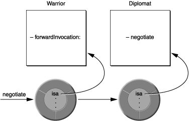

# iOS Teach Team iOS 探究 | 第八篇 Runtime详细探究

### **引言**
> Objective-C 语言将尽可能多的决策从编译和链接时推迟到运行时(Runtime)。只要有可能，它就会动态地做事。这意味着 Objective-C 不仅需要编译器，还需要 Runtime 来执行编译后的代码。Runtime 充当 Objective-C 语言的一种操作系统，可以说Runtime 是使 Objective-C 语言工作的基础。

---
* ### **运行时版本和平台**
在不同的平台上有不同版本的 Objective-C 运行时。

旧版和现代版
Objective-C 运行时有两个版本——“现代”和“传统”。现代版本是在 Objective-C 2.0 中引入的，包括许多新特性。旧版运行时的编程接口在 Objective-C 1 运行时参考中有所描述；现代版运行时的编程接口在 Objective-C 运行时参考中进行了描述。

最值得注意的新特性是现代运行时中的实例变量是“非脆弱的”：

在旧版运行时中，如果更改类中实例变量的布局，则必须重新编译从它继承的类。
在现代运行时，如果您更改类中实例变量的布局，则不必重新编译从它继承的类。
此外，现代运行时支持声明属性的实例变量合成。

平台
OS X v10.5 及更高版本上的 iPhone 应用程序和 64 位程序使用现代版本的运行时。

其他程序（OS X 桌面上的 32 位程序）使用运行时的旧版本。

### **与运行时交互**
* **Objective-C 程序在三个不同层次上与运行时系统交互：**

1. 通过 Objective-C 源代码；
> >  在大多数情况下，运行时系统在幕后自动运行。您只需编写和编译 Objective-C 源代码即可使用它。
> >
> > 当您编译包含 Objective-C 类和方法的代码时，编译器会创建实现语言动态特性的数据结构和函数调用。数据结构捕获类和类别定义以及协议声明中的信息；它们包括在 Objective-C 编程语言中定义类和协议中讨论的类和协议对象，以及方法选择器、实例变量模板和其他从源代码中提取的信息。主要运行时函数是发送消息的函数，如消息传递中所述。它由源代码消息表达式调用。

2. 通过Foundation框架的NSObject类中定义的方法；

Cocoa 中的大多数对象都是 NSObject 类的子类，因此大多数对象都继承了它定义的方法。（值得注意的例外是 NSProxy 类；有关更多信息，请参阅消息转发。）因此，它的方法建立了每个实例和每个类对象固有的行为。然而，在少数情况下，NSObject 类仅仅定义了一个模板来说明应该如何做某事；它本身并没有提供所有必要的代码。

例如，NSObject 类定义了一个描述实例方法，该方法返回一个描述类内容的字符串。这主要用于调试——GDB print-object 命令打印从此方法返回的字符串。 NSObject 的这个方法的实现不知道类包含什么，所以它返回一个带有对象名称和地址的字符串。 NSObject 的子类可以实现这个方法来返回更多的细节。例如，Foundation 类 NSArray 返回它包含的对象的描述列表。

一些 NSObject 方法只是查询运行时系统的信息。这些方法允许对象执行自省。此类方法的示例是类方法，它要求对象识别其类； isKindOfClass: 和 isMemberOfClass:，测试对象在继承层次结构中的位置； respondsToSelector:，表示一个对象是否可以接受特定的消息； conformsToProtocol:，表示对象是否声称实现了特定协议中定义的方法；和 methodForSelector:，它提供了方法实现的地址。像这样的方法使对象能够自省。

3. 并通过直接调用运行时函数。
运行时系统是一个动态共享库，其公共接口由位于 /usr/include/objc 目录中的头文件中的一组函数和数据结构组成。 其中许多函数允许您使用纯 C 来复制编译器在编写 Objective-C 代码时所做的事情。 其他构成了通过 NSObject 类的方法导出的功能的基础。 这些功能使开发运行时系统的其他接口和生成增强开发环境的工具成为可能； 在 Objective-C 中编程时不需要它们。 但是，在编写 Objective-C 程序时，一些运行时函数有时可能很有用。 所有这些函数都记录在 Objective-C 运行时参考中。


### **消息传递**
本章描述消息表达式如何转换为 objc_msgSend 函数调用，以及如何通过名称引用方法。 然后解释如何利用 objc_msgSend，以及如何（如果需要）规避动态绑定。

1. objc_msgSend 函数

在 Objective-C 中，消息直到运行时才绑定到方法实现。编译器转换消息表达式，

```
[receiver message]
```

调用消息传递函数 objc_msgSend。该函数将接收者和消息中提到的方法的名称（即方法选择器）作为它的两个主要参数：

```
objc_msgSend(receiver, selector)
```

消息中传递的任何参数也会传递给 objc_msgSend：

```
objc_msgSend(receiver, selector, arg1, arg2, ...)
```

消息传递函数完成动态绑定所需的一切：

它首先找到选择器引用的过程（方法实现）。由于相同的方法可以由不同的类以不同的方式实现，因此它找到的精确过程取决于接收器的类。
然后它调用该过程，将接收对象（指向其数据的指针）以及为该方法指定的任何参数传递给它。
最后，它将过程的返回值作为自己的返回值传递。

**注意：** 编译器会生成对消息传递函数的调用。你永远不应该在你编写的代码中直接调用它。

消息传递的关键在于编译器为每个类和对象构建的结构。 每个类结构都包含以下两个基本元素：

指向超类的指针。
类调度表。 该表具有将方法选择器与它们标识的方法的特定于类的地址相关联的条目。 setOrigin:: 方法的选择器与 setOrigin:: （实现的过程）的地址相关联， display 方法的选择器与显示器的地址相关联，依此类推。
当一个新对象被创建时，它的内存被分配，它的实例变量被初始化。 对象变量中的第一个是指向其类结构的指针。 这个称为 isa 的指针使对象可以访问其类，并通过该类访问它所继承的所有类。

**注意：** 虽然不是严格意义上的语言的一部分，但对象需要 isa 指针才能与 Objective-C 运行时系统一起工作。在结构定义的任何字段中，对象都需要与结构 objc_object（在 objc/objc.h 中定义）“等效”。但是，您很少需要创建自己的根对象，并且从 NSObject 或 NSProxy 继承的对象会自动具有 isa 变量。

类和对象结构的这些元素如图 3-1 所示。


NSObject 类。一旦找到选择器，该函数就会调用在表中输入的方法，并将接收对象的数据结构传递给它。

这是在运行时选择方法实现的方式，或者用面向对象编程的术语来说，方法是动态绑定到消息的。

为了加快消息传递过程，运行时系统会在使用方法时缓存方法的选择器和地址。每个类都有一个单独的缓存，它可以包含继承方法以及类中定义的方法的选择器。在搜索调度表之前，消息传递例程首先检查接收对象类的缓存（理论上，曾经使用过的方法可能会再次使用）。如果方法选择器在缓存中，消息传递只比函数调用慢一点。一旦一个程序运行了足够长的时间来“预热”它的缓存，它发送的几乎所有消息都会找到一个缓存方法。当程序运行时，缓存会动态增长以容纳新消息。


2. 使用函数隐藏参数
当 objc_msgSend 找到实现方法的过程时，它调用该过程并将消息中的所有参数传递给它。 它还向过程传递了两个隐藏参数：

接收对象
方法的选择器
这些参数为每个方法实现提供了关于调用它的消息表达式的两半的显式信息。 之所以说它们是“隐藏的”，是因为它们没有在定义该方法的源代码中声明。 它们在编译代码时被插入到实现中。

尽管这些参数没有显式声明，源代码仍然可以引用它们（就像它可以引用接收对象的实例变量一样）。 方法将接收对象称为 self，将其自己的选择器称为 _cmd。 在下面的示例中，_cmd 指的是奇怪方法的选择器，而 self 指的是接收到奇怪消息的对象。

```
- strange
{
    id  target = getTheReceiver();
    SEL method = getTheMethod();
 
    if ( target == self || method == _cmd )
        return nil;
    return [target performSelector:method];
}
```
self 是两个参数中更有用的一个。事实上，这是接收对象的实例变量可用于方法定义的方式。

3. 获取方法地址

绕过动态绑定的唯一方法是获取方法的地址并直接调用它，就好像它是一个函数一样。 这可能适用于特定方法将连续执行多次并且您希望避免每次执行该方法时的消息传递开销的极少数情况。

使用 NSObject 类中定义的方法 methodForSelector:，您可以请求一个指向实现方法的过程的指针，然后使用该指针调用该过程。 methodForSelector: 返回的指针必须仔细转换为正确的函数类型。 返回类型和参数类型都应该包含在转换中。

下面的示例显示了如何调用实现 setFilled: 方法的过程：
```
void (*setter)(id, SEL, BOOL);
int i;
 
setter = (void (*)(id, SEL, BOOL))[target
    methodForSelector:@selector(setFilled:)];
for ( i = 0 ; i < 1000 ; i++ )
    setter(targetList[i], @selector(setFilled:), YES);
```

传递给过程的前两个参数是接收对象 (self) 和方法选择器 (_cmd)。 这些参数隐藏在方法语法中，但在方法作为函数调用时必须明确显示。

使用 methodForSelector: 来规避动态绑定可以节省消息传递所需的大部分时间。 但是，仅当特定消息重复多次时，节省才会显着，如上面所示的 for 循环。

注意 methodForSelector: 是 Cocoa 运行时系统提供的； 它不是 Objective-C 语言本身的特性。

### **动态方法解析**

本章介绍如何动态提供方法的实现。

1. 动态方法解析
在某些情况下，您可能希望动态地提供方法的实现。 例如，Objective-C 声明的属性特性（参见 Objective-C 编程语言中的声明属性）包括 @dynamic 指令：
```
@dynamic propertyName;
```
它告诉编译器与属性关联的方法将动态提供。

您可以实现方法resolveInstanceMethod: 和resolveClassMethod: 分别为实例和类方法的给定选择器动态提供实现。

Objective-C 方法只是一个 C 函数，它至少有两个参数——self 和 _cmd。 您可以使用函数 class_addMethod 将函数作为方法添加到类中。 因此，给定以下函数：
```
void dynamicMethodIMP(id self, SEL _cmd) {
    // implementation ....
}
```

您可以使用 resolveInstanceMethod: 将其作为方法动态添加到类中（称为 resolveThisMethodDynamically），如下所示：
```
@implementation MyClass
+ (BOOL)resolveInstanceMethod:(SEL)aSEL
{
    if (aSEL == @selector(resolveThisMethodDynamically)) {
          class_addMethod([self class], aSEL, (IMP) dynamicMethodIMP, "v@:");
          return YES;
    }
    return [super resolveInstanceMethod:aSEL];
}
@end
```

转发方法（如消息转发中所述）和动态方法解析在很大程度上是正交的。 一个类有机会在转发机制启动之前动态解析方法。如果调用 respondsToSelector: 或 instancesRespondToSelector:，动态方法解析器有机会首先为选择器提供 IMP。 如果您实现了 resolveInstanceMethod: 但希望通过转发机制实际转发特定的选择器，则为这些选择器返回 NO。


2. 动态加载
Objective-C 程序可以在运行时加载和链接新的类和类别。新代码被合并到程序中，并与开始加载的类和类别相同地对待。

动态加载可以用来做很多不同的事情。例如，系统偏好应用程序中的各种模块是动态加载的。

在 Cocoa 环境中，通常使用动态加载来允许自定义应用程序。其他人可以编写程序在运行时加载的模块——就像 Interface Builder 加载自定义调色板和 OS X System Preferences 应用程序加载自定义首选项模块一样。可加载模块扩展了您的应用程序可以做的事情。他们以您允许但您自己无法预料或定义的方式为它做出贡献。您提供框架，但其他人提供代码。

尽管在 Mach-O 文件（objc_loadModules，在 objc/objc-load.h 中定义）中执行动态加载 Objective-C 模块的运行时函数，但 Cocoa 的 NSBundle 类为动态加载提供了更方便的接口——即对象面向并与相关服务相结合。有关 NSBundle 类及其使用的信息，请参阅 Foundation 框架参考中的 NSBundle 类规范。有关 Mach-O 文件的信息，请参阅 OS X ABI Mach-O 文件格式参考。

### **消息转发**
向不处理该消息的对象发送消息是错误的。但是，在宣布错误之前，运行时系统会给予接收对象第二次机会来处理消息。


1. 转发

如果您向不处理该消息的对象发送消息，则在宣布错误之前，运行时会向对象发送 forwardInvocation: 消息，其中 NSInvocation 对象作为其唯一参数 - NSInvocation 对象封装了原始消息和传递的参数用它。

您可以实现一个 forwardInvocation: 方法来对消息给出默认响应，或者以其他方式避免错误。顾名思义，forwardInvocation：通常用于将消息转发到另一个对象。

要查看转发的范围和意图，请想象以下场景：首先，假设您正在设计一个可以响应名为协商的消息的对象，并且您希望它的响应包括另一种对象的响应。您可以通过将协商消息传递给您实现的协商方法主体中的某个对象来轻松完成此操作。

更进一步，假设您希望对象对协商消息的响应与在另一个类中实现的响应完全相同。实现此目的的一种方法是让您的类从另一个类继承该方法。但是，可能无法以这种方式安排事情。您的类和实现协商的类位于继承层次结构的不同分支中可能有充分的理由。

即使你的类不能继承协商方法，你仍然可以通过实现一个简单地将消息传递给另一个类的实例的方法版本来“借用”它：
```
- (id)negotiate
{
    if ( [someOtherObject respondsTo:@selector(negotiate)] )
        return [someOtherObject negotiate];
    return self;
}
```
这种做事方式可能会有点麻烦，特别是如果您希望您的对象传递给另一个对象的许多消息。你必须实现一个方法来覆盖你想从另一个类借用的每个方法。此外，在您编写代码时，您不知道您可能想要转发的全套消息的情况是不可能处理的。该集合可能取决于运行时的事件，并且可能会随着将来实现新方法和类而改变。

forwardInvocation 提供的第二次机会：消息为这个问题提供了一个不那么特别的解决方案，而且是动态的而不是静态的。它的工作原理是这样的：当一个对象因为没有与消息中的选择器匹配的方法而无法响应消息时，运行时系统通过向对象发送 forwardInvocation: 消息来通知对象。每个对象都从 NSObject 类继承一个 forwardInvocation: 方法。然而，NSObject 版本的方法只是简单地调用了 doesNotRecognizeSelector:。通过覆盖 NSObject 的版本并实现自己的版本，您可以利用 forwardInvocation: 消息提供的机会将消息转发到其他对象。

要转发消息，所有 forwardInvocation: 方法需要做的是：

* 确定消息应该去哪里，以及
* 将其连同其原始参数一起发送到那里。

可以使用 invokeWithTarget: 方法发送消息：
```
- (void)forwardInvocation:(NSInvocation *)anInvocation
{
    if ([someOtherObject respondsToSelector:
            [anInvocation selector]])
        [anInvocation invokeWithTarget:someOtherObject];
    else
        [super forwardInvocation:anInvocation];
}
```
转发的消息的返回值将返回给原始发件人。 所有类型的返回值都可以传递给发送者，包括 id、结构和双精度浮点数。

forwardInvocation: 方法可以充当未识别消息的分发中心，将它们分配给不同的接收者。 或者它可以是一个中转站，将所有消息发送到同一个目的地。 它可以将一条消息翻译成另一条消息，或者只是“吞下”一些消息，这样就没有响应也没有错误。 forwardInvocation: 方法还可以将多个消息合并为单个响应。 forwardInvocation: 做什么取决于实现者。 然而，它为链接转发链中的对象提供了机会，为程序设计开辟了可能性。

**注意：** forwardInvocation: 方法只有在没有调用名义接收者中的现有方法时才能处理消息。 例如，如果您希望您的对象将协商消息转发给另一个对象，则它不能有自己的协商方法。 如果是这样，消息将永远不会到达 forwardInvocation:。

有关转发和调用的更多信息，请参阅 Foundation 框架参考中的 NSInvocation 类规范

2. 转发和多重继承

转发模仿继承，可以用来将多重继承的一些效果借给 Objective-C 程序。 如图 5-1 所示，通过转发消息来响应消息的对象似乎借用或“继承”了另一个类中定义的方法实现。



在此图中，Warrior 类的实例将协商消息转发到 Diplomat 类的实例。勇士似乎会像外交官一样进行谈判。它似乎会响应谈判信息，并且出于所有实际目的，它确实会响应（尽管实际上是外交官在做这项工作）。

因此，转发消息的对象从继承层次结构的两个分支“继承”方法——它自己的分支和响应消息的对象的分支。在上面的示例中，Warrior 类似乎继承自 Diplomat 以及它自己的超类。

转发提供了您通常希望从多重继承中获得的大部分功能。但是，两者之间有一个重要的区别：多重继承在一个对象中结合了不同的功能。它倾向于大型、多面的对象。另一方面，转发将不同的职责分配给不同的对象。它将问题分解为更小的对象，但以对消息发送者透明的方式关联这些对象。


3. 代理对象

转发不仅模仿多重继承，它还可以开发轻量级对象来表示或“覆盖”更实质的对象。代理代表另一个对象并将消息汇集到它。

The Objective-C Programming Language 的“远程消息传递”中讨论的代理就是这样的代理。代理负责将消息转发到远程接收者的管理细节，确保在连接中复制和检索参数值，等等。但它并没有尝试做很多其他事情。它不会复制远程对象的功能，而只是给远程对象一个本地地址，一个可以在另一个应用程序中接收消息的地方。

其他种类的代理对象也是可能的。例如，假设您有一个操作大量数据的对象——它可能会创建一个复杂的图像或读取磁盘上文件的内容。设置这个对象可能很耗时，所以你更喜欢懒惰地做——当它真的需要或者系统资源暂时空闲的时候。同时，您至少需要该对象的占位符，以便应用程序中的其他对象正常运行。

在这种情况下，您最初可以创建的不是完整的对象，而是它的轻量级代理。这个对象可以自己做一些事情，例如回答有关数据的问题，但大多数情况下，它只会为更大的对象保留一个位置，并在时机成熟时将消息转发给它。当代理的 forwardInvocation: 方法第一次收到发往另一个对象的消息时，它会确保该对象存在，如果不存在则创建它。较大对象的所有消息都通过代理，因此，就程序的其余部分而言，代理和较大对象将是相同的。

4. 转发和继承

尽管转发模拟了继承，但 NSObject 类从不混淆两者。 像 respondsToSelector: 和 isKindOfClass: 这样的方法只查看继承层次结构，从不查看转发链。 例如，如果询问 Warrior 对象是否响应协商消息，
```
if ( [aWarrior respondsToSelector:@selector(negotiate)] )
    ...
```

答案是否定的，即使它可以毫无错误地接收协商消息并在某种意义上通过将它们转发给外交官来响应它们。 （见图 5-1。）

在许多情况下，NO 是正确的答案。 但它可能不是。 如果您使用转发来设置代理对象或扩展类的功能，那么转发机制应该与继承一样透明。 如果您希望您的对象表现得好像它们真正继承了它们将消息转发到的对象的行为，您需要重新实现 respondsToSelector: 和 isKindOfClass: 方法以包含您的转发算法：
```
- (BOOL)respondsToSelector:(SEL)aSelector
{
    if ( [super respondsToSelector:aSelector] )
        return YES;
    else {
        /* Here, test whether the aSelector message can     *
         * be forwarded to another object and whether that  *
         * object can respond to it. Return YES if it can.  */
    }
    return NO;
}
```
除了 respondsToSelector: 和 isKindOfClass:，instancesRespondToSelector: 方法也应该反映转发算法。 如果使用协议，conformsToProtocol: 方法同样应该添加到列表中。 类似地，如果一个对象转发它接收到的任何远程消息，它应该有一个版本的 methodSignatureForSelector: 可以返回最终响应转发消息的方法的准确描述； 例如，如果一个对象能够将消息转发给它的代理，你将实现 methodSignatureForSelector: 如下：

```
- (NSMethodSignature*)methodSignatureForSelector:(SEL)selector
{
    NSMethodSignature* signature = [super methodSignatureForSelector:selector];
    if (!signature) {
       signature = [surrogate methodSignatureForSelector:selector];
    }
    return signature;
}
```

您可能会考虑将转发算法放在私有代码中的某个位置，并拥有所有这些方法，forwardInvocation: 包括在内，调用它。

**注意：** 这是一种高级技术，仅适用于没有其他解决方案的情况。 它不打算作为继承的替代品。 如果您必须使用此技术，请确保您完全了解进行转发的类的行为以及您要转发到的类。

本节中提到的方法在 Foundation 框架参考中的 NSObject 类规范中进行了描述。有关 invokeWithTarget: 的信息，请参阅 Foundation 框架参考中的 NSInvocation 类规范。


本文件的组织

本文档包含以下章节：

运行时版本和平台

与运行时交互

消息传递

动态方法解析

消息转发

类型编码

声明的属性


---
### **拓展知识**

---
### **总结**

本文着眼于 NSObject 类以及 Objective-C 程序如何与运行时系统交互。特别是在运行时动态加载新类以及将消息转发给其他对象的范例介绍。还提供了有关如何在程序运行时查找有关对象的信息的信息。看完这篇文章，我们应该基本上了解了 Objective-C 运行时系统的工作原理以及如何利用它。

### **参考资料：**


---
### **关于技术组**
iOS 技术组主要用来学习、分享日常开发中使用到的技术，一起保持学习，保持进步。文章仓库在这里：https://github.com/minhechen/iOSTechTeam 微信公众号：iOS技术组，欢迎联系进群学习交流，感谢阅读。