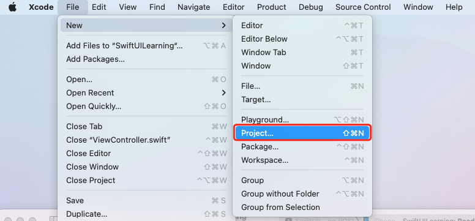
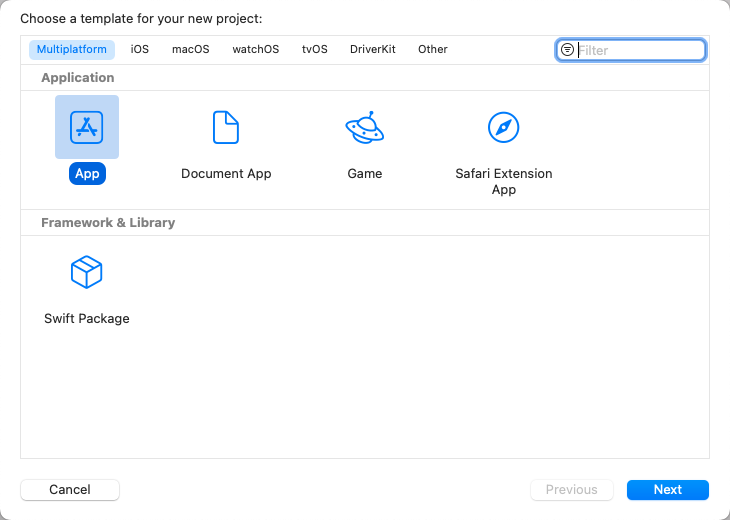
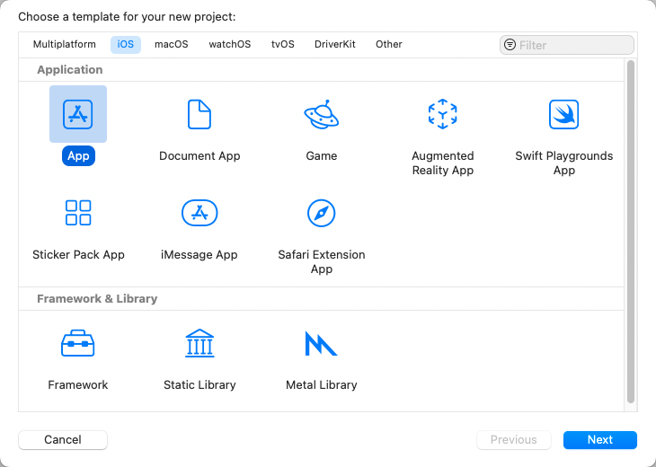
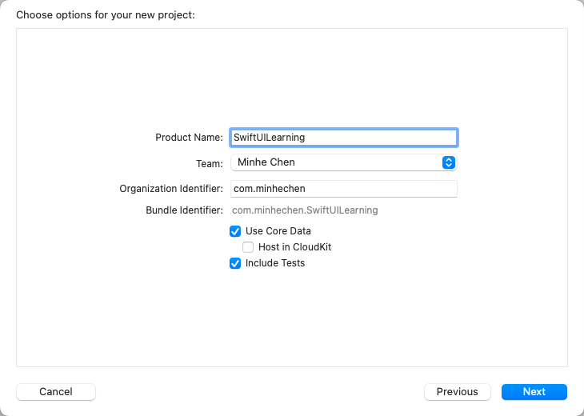
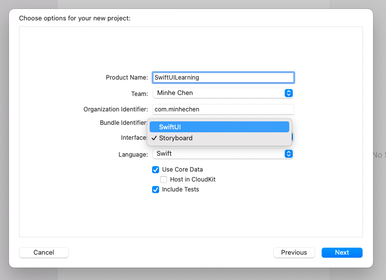
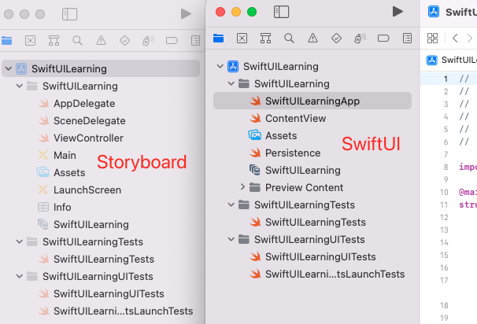
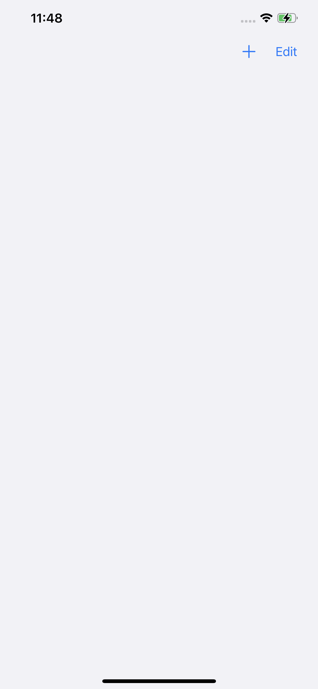
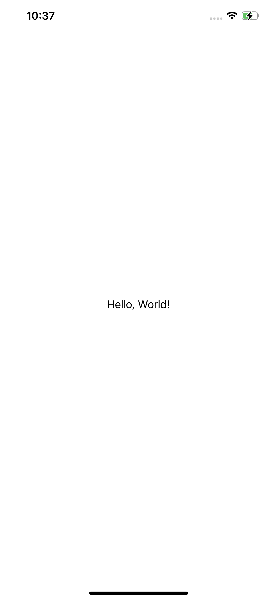
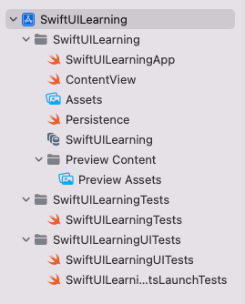
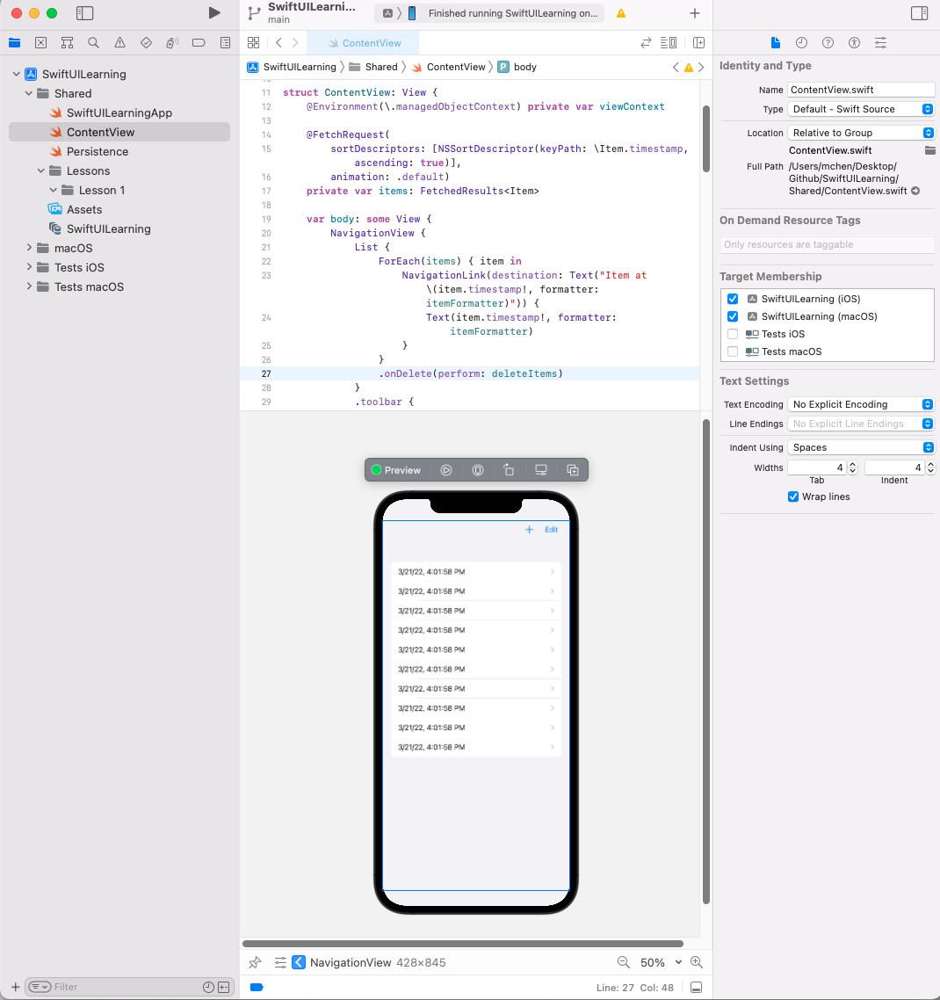

# iOS Teach Team iOS SwiftUI 入门第一步-创建工程知多少

### **引言**
> Swift 编程语言于 2014 年发布，已迅速成为历史上发展最快的语言之一。Swift 使编写设计得非常快速和安全的软件变得容易。而 SwiftUI 是一种使用 Swift 语言在苹果设备上构建用户界面的创新且简单的方式。借助 SwiftUI，使用一套工具和 API 便可以利用 Swift 的强大功能打造适合各个 Apple 平台的精美 app，而无需为每个平台单独编写大量代码，本文着重介绍一下如何创建一个 SwiftUI 基础工程，老司机请直行右转。

---
### **创建工程**
打开 `Xcode` 然后通过 `File -> New -> Project` 或者通过默认快捷键 `Shift + Command + N` 即创建工程。



此后会弹出 `Choose a template for your new project` 窗口，这是一个选择工程类型窗口，我们可以选择多平台（ `Multiplatform` 默认 iOS 及 macOS 平台），或者单独选择一个适合自己的平台。

多平台：


iOS 工程：


点击 下一步 `Next`，如果你选择的是 `Multiplatform` ，现在需要你给自己的工程输入一个 `Product Name`，比如我输入的是 `SwiftUILearning` 。



对于 iOS 工程略有差异，主要集中在 Interface 及 Language，此处我们暂不讨论 `Objective-C`，所以 Language 这块默认就用 Swift。



`Interface` 的选择直接决定了我们创建工程后看到的项目结构



可以看到，左侧工程就是一个普通的 Swift 工程，里面并不包含任何 SwiftUI 代码，而右侧则是一个标准的 SwiftUI 工程，跑起来就可以看到默认 SwiftUI 工程界面。



但如果我们选择了一个普通的 `Swift` 工程，如何支持 `SwiftUI` 界面展示呢，此处简单介绍一下如何实现，在 `SceneDelegate` 的代理方法里面，我们加上 `SwiftUI` 界面展示

```
func scene(_ scene: UIScene, willConnectTo session: UISceneSession, options connectionOptions: UIScene.ConnectionOptions) {

    let contentView = ContentView()
    guard let windowScene = (scene as? UIWindowScene) else { return }
    let window = UIWindow(windowScene: windowScene)
    window.rootViewController = UIHostingController(rootView: contentView)
    self.window = window
    window.makeKeyAndVisible()

}
```
对应 `SwiftUI` 的 `ContentView.swift`，我们这里的实现很简单，展示了一个 `Text` 内容为 `Hello, World!`，具体代码及效果如下：

```
import SwiftUI

struct ContentView: View {
    var body: some View {
        Text("Hello, World!")
    }
}

struct ContentView_Previews: PreviewProvider {
    static var previews: some View {
        ContentView()
    }
}
```



至此，我们已初步完成了一个 SwiftUI 工程的创建，可以通过模拟器或者真机 Run 一下看看效果。

---
### **工程结构**

一个标准的 SwiftUI 工程初始包括主工程资源及代码，Unit Tests 代码， UI Tests 代码，三部分组成（当然也可以不要 Tests 或者把 Unit/UI Tests 放在一起）。


上面部分是工程的功能代码及资源配置文件列表，后面的两部分分别是 Unit Tests （单元测试）及 UI Tests （UI 测试）。前期我们暂时不会对这两部分 Tests 做过多介绍，后续用到时会有专门文章介绍。

打开 SwiftUILearningApp.swift 代码，这个地方就整个工程的初始化并运行应用程序的入口。`@main` SwiftUI 提供了该方法的默认实现，该方法以适合平台的方式管理启动过程。

```
@main
struct SwiftUILearningApp: App {
    let persistenceController = PersistenceController.shared

    var body: some Scene {
        WindowGroup {
            ContentView()
                .environment(\.managedObjectContext, persistenceController.container.viewContext)
        }
    }
}
```

程序启动后展示 ContentView ，打开 ContentView.swift ，我们看到两个结构体：

```

struct ContentView: View {
    @Environment(\.managedObjectContext) private var viewContext

    @FetchRequest(
        sortDescriptors: [NSSortDescriptor(keyPath: \Item.timestamp, ascending: true)],
        animation: .default)
    private var items: FetchedResults<Item>

    var body: some View {
        NavigationView {
            List {
                ForEach(items) { item in
                    NavigationLink {
                        Text("Item at \(item.timestamp!, formatter: itemFormatter)")
                    } label: {
                        Text(item.timestamp!, formatter: itemFormatter)
                    }
                }
                .onDelete(perform: deleteItems)
            }
            .toolbar {
                ToolbarItem(placement: .navigationBarTrailing) {
                    EditButton()
                }
                ToolbarItem {
                    Button(action: addItem) {
                        Label("Add Item", systemImage: "plus")
                    }
                }
            }
            Text("Select an item")
        }
    }
}

struct ContentView_Previews: PreviewProvider {
    static var previews: some View {
        ContentView().environment(\.managedObjectContext, PersistenceController.preview.container.viewContext)
    }
}

```

第一个结构体遵循 View 协议，描述视图的内容和布局。第二个结构体则 遵循 PreviewProvider 协议，用以声明第一个视图的预览视图。点击画布 Canvas 顶部的 Resume 按钮可以实时预览当前视图。



我们注意到，所有的内容展示都是在 body 内部，这里需要说一下，当我们实现一个自定义视图时，必须实现一个计算 body 属性来为你的视图提供内容。返回一个由 SwiftUI 提供的内置视图以及已经定义的其他复合视图组成的视图。

---
### **声明自定视图**

* 声明式语法

SwiftUI 为用户界面设计提供一种声明的方法。在使用传统的命令式方法时，你的控制器代码不仅要担负视图实例化、布局和配置的任务，还要随着条件发生变化持续进行更新。相比之下，借助声明式方法，你可以通过声明视图来创建用户界面的轻量级描述，视图的层级结构反映了所需的界面布局。然后，SwiftUI 会管理这些视图的绘制和更新以响应用户输入和状态更改等事件。


* 遵从 View 协议
通过定义一个遵从 View 协议的结构来声明自定视图类型：
```
struct MyView: View {
    //
}
```
与其他 Swift 协议一样，View 协议提供一个功能蓝图，在本例中是 SwiftUI 在屏幕上绘制的元素的行为。协议的遵从包含了两个方面，视图必须满足的要求以及协议提供的功能。在满足要求后，你可以将自定视图插入视图层次结构中，以使它成为你的 app 用户界面的一部分。

* 声明 Body

View 协议的主要要求是遵从类型必须定义一个 body 计算属性：

struct MyView: View {
    var body: some View {
       //
    }
}
SwiftUI 会在需要更新视图的任何时候读取此属性的值，这在视图的生命周期中可能重复发生，通常用来响应用户输入或系统事件。视图返回的值是 SwiftUI 在屏幕上绘制的一个元素。

View 协议的次要要求是遵从类型必须为 body 属性指明一个关联类型。然而，你不是进行显式声明，而是使用 some View 语法将 body 属性声明为不透明类型，以仅指明该 body 的类型符合 View 。确切类型取决于 body 的内容，该内容会随着你在开发期间编辑 body 而变化。Swift 会自动推断确切类型。

* 组合视图的内容

通过将内容添加到视图的 body 属性来描述视图的外观。可以从 SwiftUI 提供的原生视图以及你在其他地方定义的自定视图编写 body。例如，可以使用内建的 Text 视图创建一个绘制字符串“Hello, World!”的 body：
```
struct MyView: View {
    var body: some View {
        Text("Hello, World!")
    }
}
```
渲染文本视图的截屏，其中显示了采用正文字体的文本“Hello World”。

除了用于特定内容、控件和指示器类型的视图外，例如 Text 、Toggle 和 ProgressView ，SwiftUI 还会提供可用来排列其他视图的原生视图。例如，可以使用 VStack 垂直堆叠两个 Text 视图：
```
struct MyView: View {
    var body: some View {
        VStack {
            Text("Hello, World!")
            Text("Glad to meet you.")
        }
    }
}
```
两个渲染文本视图的截屏，一上一下分别显示了文本“Hello World”和文本“Glad to meet you”。这两个视图都是以正文字体渲染的。


采用多个输入子视图的视图 (例如，上述示例中的 stack) 通常使用一个以 ViewBuilder 属性标记的闭包来执行此操作。这样可形成在调用点不需要附加语法的多语句闭包。仅需要连续列出输入视图。

---
### **总结**

到这里我们对 SwiftUI 工程的创建有了一个基本的了解，接下来会针对更多的语法特性及使用方式进行介绍，以上就是本文对 SwiftUI 工程相关知识点的介绍，感谢阅读。

---

### **参考资料：**

[SwiftUI](https://developer.apple.com/documentation/swiftui)

[Declaring a Custom View](https://developer.apple.com/documentation/swiftui/declaring-a-custom-view/)

---
### **关于技术组**
iOS 技术组主要用来学习、分享日常开发中使用到的技术，一起保持学习，保持进步。文章仓库在这里：https://github.com/minhechen/iOSTechTeam 微信公众号：iOS技术组，欢迎联系交流，感谢阅读。